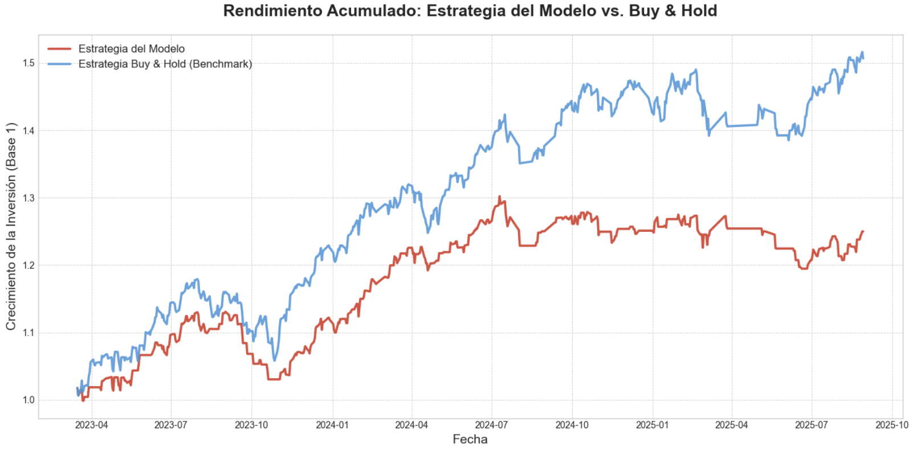

# S&P 500 Return Forecasting with Linear Regression

[](https://www.python.org/)
[](https://scikit-learn.org/)
[](LICENSE)

## Descripción del Proyecto

Implementación de modelos de Machine Learning para la predicción de rentabilidades del índice S&P 500 utilizando técnicas de regresión lineal y análisis de series temporales. Este proyecto demuestra la aplicación de metodologías estadísticas avanzadas y aprendizaje automático en el análisis cuantitativo de mercados financieros.

## Objetivos

- **Ingeniería de Datos**: Procesamiento y transformación de datos históricos del S&P 500 para análisis cuantitativo.
- **Feature Engineering**: Desarrollo de variables predictivas derivadas (rentabilidades, medias móviles, indicadores técnicos).
- **Modelado Predictivo**: Implementación de modelos de regresión lineal con diferentes estrategias de entrenamiento.
- **Evaluación Rigurosa**: Aplicación de métricas estándar de la industria (RMSE, MAE, R²) para validación de modelos.
- **Visualización de Datos**: Generación de gráficos analíticos para interpretación de resultados.

## Arquitectura de Modelos

### Modelo B: Regresión Lineal Clásica
Implementación estándar con división temporal train/test. Ajusta un único modelo sobre el conjunto completo de entrenamiento, optimizando parámetros mediante mínimos cuadrados ordinarios (OLS).

**Características:**
- División temporal estratificada 80/20
- Validación out-of-sample
- Métricas de rendimiento comparativas

### Modelo C: Rolling Window Regression
Estrategia avanzada de ventana deslizante temporal que captura la dinámica no estacionaria de los mercados financieros.

**Características:**
- Ventana móvil de tamaño $N$ configurable
- Re-entrenamiento iterativo adaptativo
- Captura de patrones recientes y cambios de régimen
- Mayor robustez ante volatilidad del mercado

**Formulación matemática:**

$$r_t = \frac{\text{Close}_t - \text{Close}_{t-1}}{\text{Close}_{t-1}}$$

donde $r_t$ representa la rentabilidad logarítmica diaria.

## Estructura del Proyecto

```
PL1/
├── Cuaderno.ipynb          # Notebook principal con análisis completo
├── datos.csv               # Dataset histórico S&P 500
├── PDF/
│   └── Practica 1_IA_ENTREGABLE_2025_2026.pdf
└── readme.md               # Documentación del proyecto
```

## Stack Tecnológico

- **Python 3.8+**: Lenguaje de programación principal
- **pandas**: Manipulación y análisis de datos
- **NumPy**: Computación numérica y operaciones matriciales
- **scikit-learn**: Implementación de modelos ML y métricas
- **Matplotlib/Plotly**: Visualización avanzada de datos
- **Jupyter Notebook**: Entorno de desarrollo interactivo

## Instalación y Ejecución

### Requisitos Previos
```bash
pip install pandas numpy scikit-learn matplotlib plotly jupyter
```

### Ejecución del Proyecto
1. Clonar el repositorio:
```bash
git clone https://github.com/M1tr1ca/SP500-Return-Forecast-Linear-Regression.git
cd SP500-Return-Forecast-Linear-Regression
```

2. Abrir el notebook en Jupyter:
```bash
jupyter notebook Cuaderno.ipynb
```

3. Ejecutar las celdas secuencialmente para reproducir el análisis completo.

## Metodología

1. **Preprocesamiento de Datos**
   - Limpieza y validación de datos faltantes
   - Conversión de tipos de datos temporales
   - Ordenamiento cronológico estricto

2. **Feature Engineering**
   - Cálculo de rentabilidades logarítmicas
   - Generación de rezagos (lags) temporales
   - Medias móviles simples (SMA) y exponenciales (EMA)
   - Indicadores de volatilidad

3. **Entrenamiento de Modelos**
   - División temporal train/test preservando orden cronológico
   - Ajuste de hiperparámetros
   - Validación cruzada temporal (opcional)

4. **Evaluación y Métricas**
   - Root Mean Squared Error (RMSE)
   - Mean Absolute Error (MAE)
   - Coefficient of Determination (R²)
   - Análisis de residuales

5. **Visualización de Resultados**
   - Series temporales: valores reales vs. predicciones
   - Scatter plots: correlación predicción-realidad
   - Distribución de errores

## Resultados

El proyecto proporciona métricas cuantitativas del rendimiento de cada modelo, permitiendo comparaciones objetivas. Los resultados incluyen:
- Capacidad predictiva sobre datos no vistos
- Análisis de estabilidad temporal
- Comparativa entre estrategias de modelado

### Rendimiento Acumulado: Estrategia del Modelo vs. Buy & Hold

El siguiente gráfico muestra la comparación del rendimiento acumulado entre la estrategia basada en las predicciones del modelo y una estrategia pasiva de comprar y mantener (Buy & Hold) que sirve como benchmark:



**Interpretación de Resultados:**
- La línea azul representa la estrategia **Buy & Hold** (benchmark de mercado)
- La línea roja representa la **Estrategia del Modelo** basada en predicciones
- El gráfico ilustra el crecimiento de la inversión a lo largo del tiempo (Base = 1)
- Permite evaluar visualmente si el modelo añade valor frente a una estrategia pasiva

## Contribuidores

<table>
  <tr>
    <td align="center">
      <a href="https://github.com/M1tr1ca">
        <br />
        <sub><b>David Mitrică</b></sub>
      </a>
    </td>
    <td align="center">
      <a href="https://github.com/JaimeCN05">
        <br />
        <sub><b>Jaime Criado Nieto</b></sub>
      </a>
    </td>
    <td align="center">
      <a href="https://github.com/albecst">
        <br />
        <sub><b>Alberto</b></sub>
      </a>
    </td>
    <td align="center">
      <a href="https://github.com/juanprzzz">
        <br />
        <sub><b>Juan Pérez</b></sub>
      </a>
    </td>
  </tr>
</table>

## Licencia y Disclaimer

Este proyecto tiene fines exclusivamente educativos y de investigación académica. No constituye asesoramiento financiero ni recomendaciones de inversión.

**Universidad de Alcalá - Inteligencia Artificial**

---

*Desarrollado como parte del programa de Ingeniería Informática en la Universidad de Alcalá de Henares, 2025-2026.*
