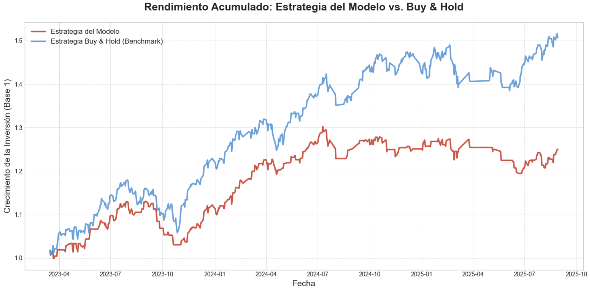

# S&P 500 Return Forecasting with Linear Regression

[](https://www.python.org/)
[](https://scikit-learn.org/)
[](#academic-context)
[](#academic-context)

## Project Description

Implementation of Machine Learning models for predicting S&P 500 index returns using linear regression techniques and time series analysis. This project demonstrates the application of advanced statistical methodologies and machine learning in the quantitative analysis of financial markets.

## Objectives

- **Data Engineering**: Processing and transformation of historical S&P 500 data for quantitative analysis.
- **Feature Engineering**: Development of derived predictive variables (returns, moving averages, technical indicators).
- **Predictive Modeling**: Implementation of linear regression models with different training strategies.
- **Rigorous Evaluation**: Application of industry-standard metrics (RMSE, MAE, R²) for model validation.
- **Data Visualization**: Generation of analytical plots for results interpretation.

## Model Architecture

### Model B: Classic Linear Regression
Standard implementation with temporal train/test split. Fits a single model over the complete training set, optimizing parameters using ordinary least squares (OLS).

**Characteristics:**
- Stratified temporal 80/20 split
- Out-of-sample validation
- Comparative performance metrics

### Model C: Rolling Window Regression
Advanced temporal sliding window strategy that captures the non-stationary dynamics of financial markets.

**Characteristics:**
- Configurable rolling window of size $N$
- Adaptive iterative retraining
- Capture of recent patterns and regime changes
- Greater robustness against market volatility

**Mathematical formulation:**

$$r_t = \frac{\text{Close}_t - \text{Close}_{t-1}}{\text{Close}_{t-1}}$$

where $r_t$ represents the daily daily return.

## Project Structure

```
PL1/
├── Cuaderno.ipynb          # Main notebook with complete analysis (in Spanish)
├── PL1.ipynb               # Notebook in Spanish
├── PL1_spanish.ipynb       # Notebook in Spanish (copy)
├── PL1_english.ipynb       # Notebook in English (translated)
├── datos.csv               # Historical S&P 500 dataset
├── PDF/
│   └── Practica 1_IA_ENTREGABLE_2025_2026.pdf
├── readme_spanish.md       # Project documentation in Spanish
└── readme.md               # Project documentation in English
```

## Technology Stack

- **Python 3.8+**: Main programming language
- **pandas**: Data manipulation and analysis
- **NumPy**: Numerical computing and matrix operations
- **scikit-learn**: ML model implementation and metrics
- **Matplotlib/Plotly**: Advanced data visualization
- **Jupyter Notebook**: Interactive development environment

## Installation and Execution

### Prerequisites
```bash
pip install pandas numpy scikit-learn matplotlib plotly jupyter
```

### Running the Project
1. Clone the repository:
```bash
git clone https://github.com/M1tr1ca/SP500-Return-Forecast-Linear-Regression.git
cd SP500-Return-Forecast-Linear-Regression
```

2. Open the notebook in Jupyter:
```bash
jupyter notebook PL1_english.ipynb
```

3. Run the cells sequentially to reproduce the complete analysis.

## Methodology

1. **Data Preprocessing**
   - Handling and validation of missing data
   - Temporal data type conversion
   - Strict chronological sorting

2. **Feature Engineering**
   - Calculation of daily returns
   - Generation of temporal lags
   - Simple Moving Averages (SMA) and Exponential Moving Averages (EMA)
   - Volatility indicators

3. **Model Training**
   - Temporal train/test split preserving chronological order
   - Hyperparameter tuning
   - Temporal cross-validation (optional)

4. **Evaluation and Metrics**
   - Root Mean Squared Error (RMSE)
   - Mean Absolute Error (MAE)
   - Coefficient of Determination (R²)
   - Residual analysis

5. **Data Visualization**
   - Time series: actual values vs. predictions
   - Scatter plots: prediction-actual correlation
   - Error distribution

## Results

The project provides quantitative metrics of each model's performance, allowing objective comparisons. The results include:
- Predictive capacity on unseen data
- Temporal stability analysis
- Comparison between modeling strategies

### Cumulative Performance: Model Strategy vs. Buy & Hold

The following chart shows the comparison of the cumulative performance between the strategy based on the model's predictions and a passive buy-and-hold (Buy & Hold) strategy that serves as a benchmark:



**Results Interpretation:**
- The blue line represents the **Buy & Hold** strategy (market benchmark)
- The red line represents the **Model Strategy** based on predictions
- The chart illustrates the growth of the investment over time (Base = 1)
- Allows visual assessment of whether the model adds value compared to a passive strategy

## Contributors

<table>
  <tr>
    <td align="center">
      <a href="https://github.com/M1tr1ca">
        <br />
        <sub><b>David Mitrică</b></sub>
      </a>
    </td>
    <td align="center">
      <a href="https://github.com/JaimeCN05">
        <br />
        <sub><b>Jaime Criado Nieto</b></sub>
      </a>
    </td>
    <td align="center">
      <a href="https://github.com/albecst">
        <br />
        <sub><b>Alberto</b></sub>
      </a>
    </td>
    <td align="center">
      <a href="https://github.com/juanprzzz">
        <br />
        <sub><b>Juan Pérez</b></sub>
      </a>
    </td>
  </tr>
</table>

## License and Disclaimer

This project is for educational and academic research purposes only. It does not constitute financial advice or investment recommendations.

**University of Alcalá - Artificial Intelligence**

---

*Developed as part of the Computer Engineering program at the University of Alcalá de Henares, 2025-2026.*
